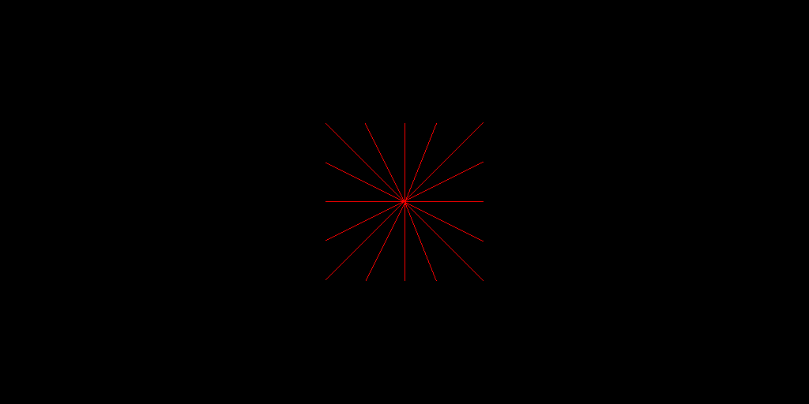
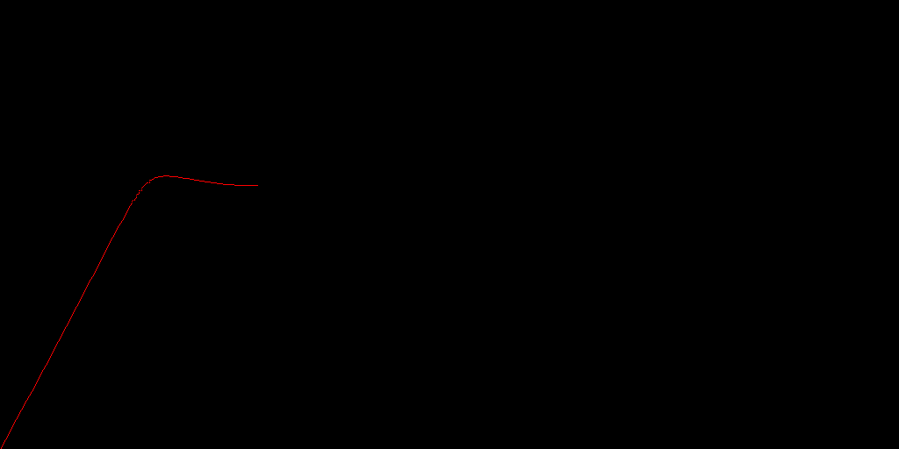
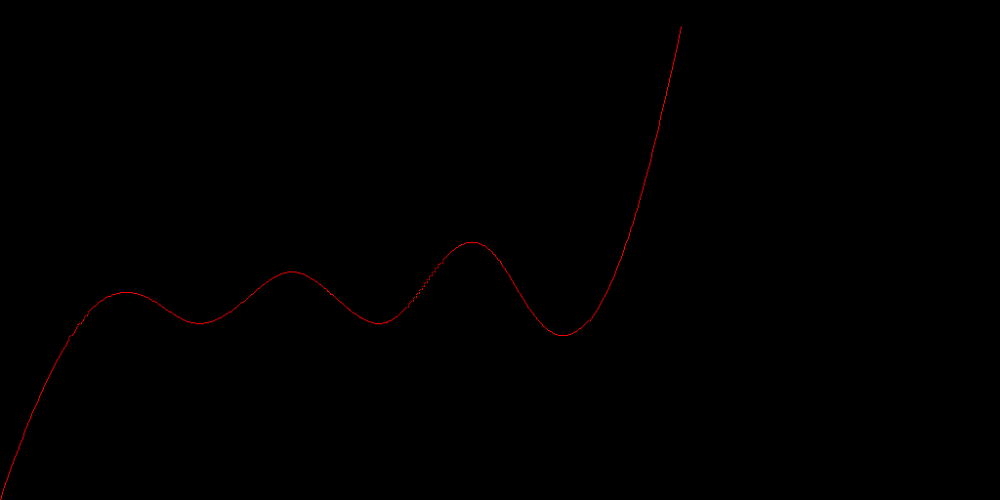
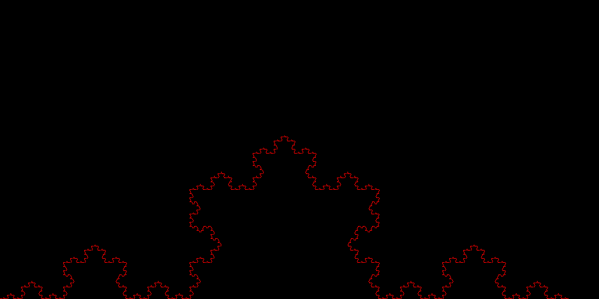
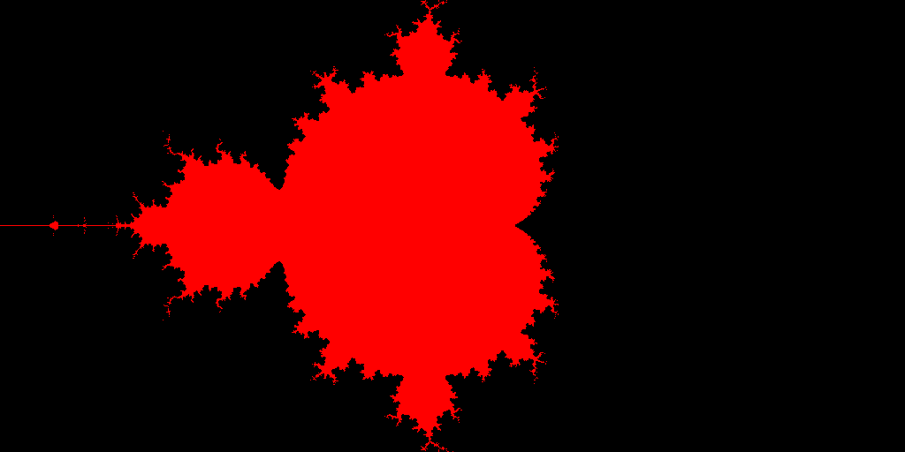
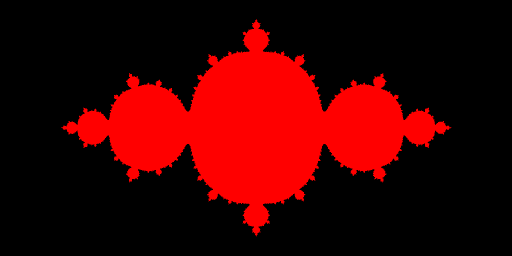
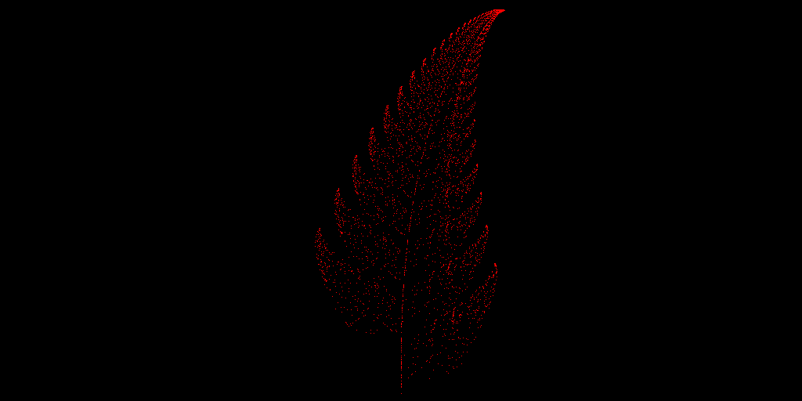
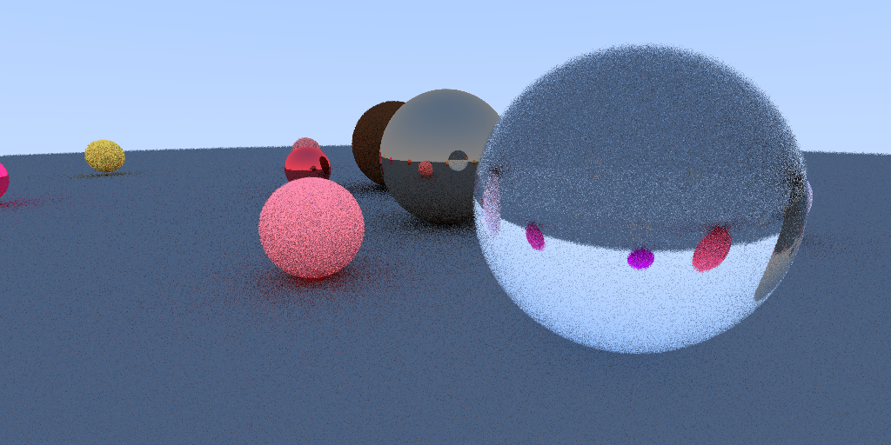

[](https://github.com/Freed-Wu/computer-graphics-homework/actions)
[](https://computer-graphics-demo.readthedocs.io)

[](https://github.com/Freed-Wu/computer-graphics-homework/releases)
[](https://github.com/Freed-Wu/computer-graphics-homework/releases/latest)
[](https://github.com/Freed-Wu/computer-graphics-homework/issues)
[](https://github.com/Freed-Wu/computer-graphics-homework/issues?q=is%3Aissue+is%3Aclosed)
[](https://github.com/Freed-Wu/computer-graphics-homework/pulls)
[](https://github.com/Freed-Wu/computer-graphics-homework/pulls?q=is%3Apr+is%3Aclosed)
[](https://github.com/Freed-Wu/computer-graphics-homework/discussions)
[](https://github.com/Freed-Wu/computer-graphics-homework/milestones)
[](https://github.com/Freed-Wu/computer-graphics-homework/network/members)
[](https://github.com/Freed-Wu/computer-graphics-homework/stargazers)
[](https://github.com/Freed-Wu/computer-graphics-homework/watchers)
[](https://github.com/Freed-Wu/computer-graphics-homework/graphs/contributors)
[](https://github.com/Freed-Wu/computer-graphics-homework/graphs/commit-activity)
[](https://github.com/Freed-Wu/computer-graphics-homework/commits)
[](https://github.com/Freed-Wu/computer-graphics-homework/releases/latest)

[](https://github.com/Freed-Wu/computer-graphics-homework/blob/master/LICENSE)


[](https://pypi.org/project/computer-graphics-demo/0.0.2/#files)
[](https://pypi.org/project/computer-graphics-demo)


## 三次书面作业

各 10 分，共 30 分；查找一篇你看不懂的计算机图形学文献，整理出以下问题

- 该论文解决的问题是什么？
- 采用的是什么方法？
- 得到了什么结论

## 一份编程作业

30 分；算法任选，不可调用已有函数（画点函数除外），提交可执行程序和实验报告。

```shell
$ pip install computer-graphics-demo
$ cgdemo --help
Computer graphics algorithms demonstration.

usage: cgdemo [-hVdns] [ [-v] | [-q|-qq] ] [-x <height>] [-y <width>] [-o <out>]
    [-c <color>] [-a <args>] [-t <time>] <command>

options:
    -h, --help              Show this screen.
    -V, --version           Show version.
    -d, --debug             Debug this program.
    -n, --dry-run           Don't show any canvas.
    -s, --second            Use second algorithm. See section algorithm.
    -v, --verbose           Output verbosity. (e.g., default arguments)
    -q, --quiet             Redirect stdout to null. Again for stderr.
    -x, --height <height>   Height of canvas. [default: 512]
    -y, --width <width>     Width of canvas. [default: 1024]
    -o, --output <out>      Save output to a file. See section output.
    -c, --color <color>     Color of graph. [default: 255,0,0]
    -a, --args <args>       Arguments. See section argument.
    -t, --timeout <time>    Auto exit. [default: 30]

commands:
    line                    Draw a line.
    circle                  Draw a circle.
    ellipse                 Draw a ellipse.
    fill                    Fill a region.
    bezier                  Draw a Bezier curve.
    b                       Draw a B-spline.
    koch                    Draw a Koch curve.
    mandelbrot              Draw a Mandelbrot set.
    julia                   Draw a Julia set.
    fern                    Draw a fern.
    reality                 Draw a scene by hidden surface removal, mirror
                            reflection, texture, etc.

output: (%d is format string)
    *%d*.png
    *%d*.jpg
    *%d*.bmp
    */video.mp4
    */video.gif

algorithm:
                default                     second
    line        midpoint                    bresenham
    circle      midpoint                    bresenham
    ellipse     midpoint
    fill        scan                        seed
    bezier      Bezier
    b           De_Boor
    koch        Lindenmayer_system
    mandelbrot  f(z)=z*z+c
    julia       f(z)=z*z+c
    fern        iterated_fuction_system
    reality     ray_tracing

argument:
    line        x1,y1,x2,y2,...
    circle      x0,y0,r
    ellipse     x0,y0,a,b
    fill (scan) x1,y1,x2,y2,x3,y3,...
    fill (seed) x_seed,y_seed,x1,y1,x2,y2,x3,y3,...
    bezier      sample_number,x1,y1,...
    b           degree,x1,y1,...
    koch        scale,iteration_max,x0,y0
    mandelbrot  scale,iteration_max
    julia       scale,iteration_max
    fern        scale,iteration_max,x0,y0
    reality     sample_number,r_aperture
```

### 参数修改

- `cgdemo -c255,0,0 -a0,0,50,100,100,30 line` 可以画出一条从 (0, 0)
  到 (50, 100) 再到 (100, 30) 的红色直线。其余 10 个命令类似。
- 对有的命令提供了 2 种不同算法的实现，用 `-s` 切换算法。
- 可以用 `-o` 输出图片或视频。注意支持的文件格式和文件名。
- 默认颜色均为红色，最后一个命令除外（因为有多个颜色，改为随机）。
- 默认参数可通过 `-v` 查看。
- `-n` 可以不打开窗口。

### 注意事项

直线允许有 16 种情况（没有使用 16 个条件判断，那样的实现太脏了）



椭圆允许有 $a = b$ 等 3 种情况。

雪花曲线的参数中迭代次数太大会因为 Out of Memory 被 kill 。

为了保证跨平台性和开发效率使用 python 开发。所以第一次运行等待时间会长一点，第
二次之后会因为生成字节码快一点。

### 代码结构

```shell
$ exa -T
.
├── 1.md // 前 3 次作业的 markdown 文件
├── 2.md
├── 3.md
├── docs
│  ├── api.rst
│  ├── conf.py
│  ├── index.rst
│  ├── make.bat
│  └── Makefile
├── images // 本文中出现的所有图片
│  ├── 16line.png
│  ├── b.png
│  ├── bezier.png
│  ├── circle.png
│  ├── ellipse.png
│  ├── fern.png
│  ├── fill.png
│  ├── julia.png
│  ├── koch.png
│  ├── line.png
│  ├── mandelbrot.png
│  └── reality.png
├── LICENSE
├── pyproject.toml
├── README.md // 本文
├── requirements.txt
├── scripts
│  └── generate_images.sh // 运行此程序可以生成本文中出现的所有图片
├── setup.py
└── src // 所有算法的演示，名字与算法的对应关系见 `cgdemo --help` 的输出
   └── computer_graphics_demo
      ├── __init__.py
      ├── __main__.py // 主程序
      ├── b.py
      ├── bezier.py
      ├── circle
      │  ├── __init__.py
      │  ├── bresenham.py
      │  └── midpoint.py
      ├── ellipse.py
      ├── fern.py
      ├── fill
      │  ├── __init__.py
      │  ├── scan.py
      │  └── seed.py
      ├── julia.py
      ├── koch.py
      ├── line
      │  ├── __init__.py
      │  ├── bresenham.py
      │  └── midpoint.py
      ├── mandelbrot.py
      └── reality.py
```

主程序只负责命令行选项的读取和 GUI 窗口的初始化，实际会调用 `utils` 下各个子模
块的 `paint()`{.py} 完成绘制。 `paint()`{.py} 实现算法，最终会调用
`setpixel()`{.py}, `set8pixel()`{.py}, `set4pixel()`{.py} 等函数。

参考的来源均在注释中标出，例如 wikipedia 和某些博客中 C 或 python 的代码。

以下生成的图形均是在默认参数下生成的，比如 `cgdemo line`{.sh} 如果想修改参数看
[参数修改](#%E5%8F%82%E6%95%B0%E4%BF%AE%E6%94%B9)，修改某些参数需要注意，比如雪花曲线的参数中迭代次数不要太
大等等。

### 图元的生成


### 样条曲线的生成





### 分形图形的生成









### 真实感图形的生成

显示一个具有真实感场景的图形，几何造型自定义，包括消隐、镜面反射、纹理效果



## 期末考试

40 分
